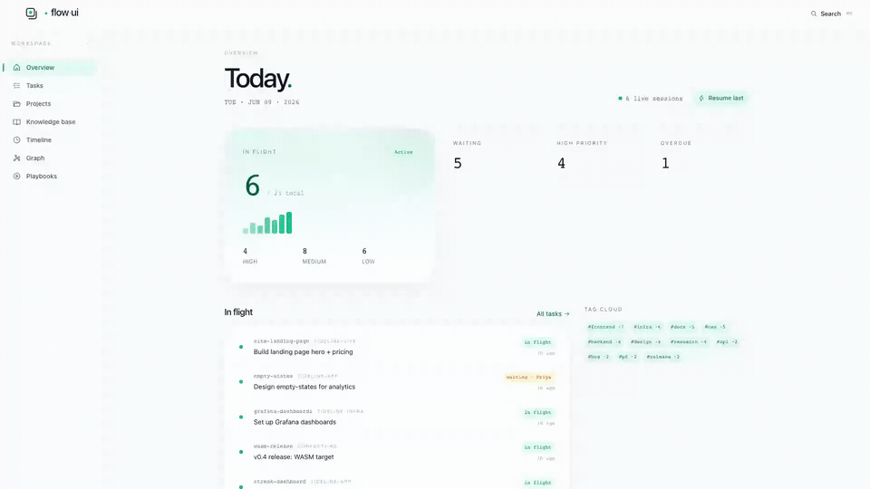
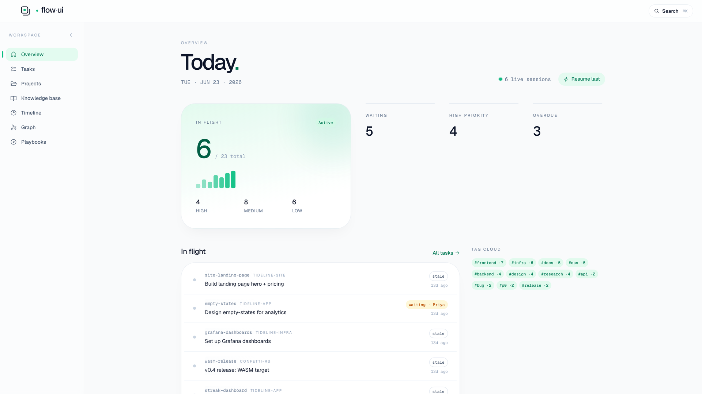
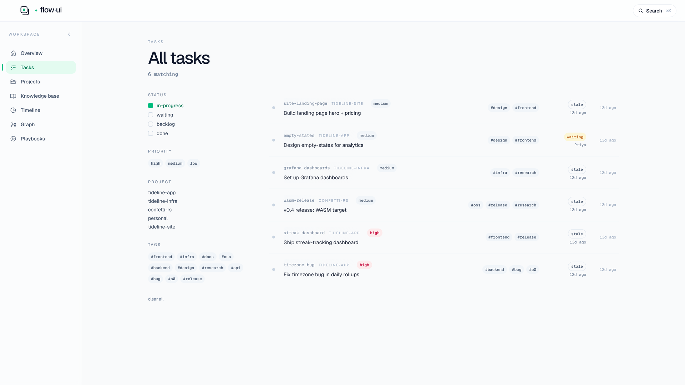
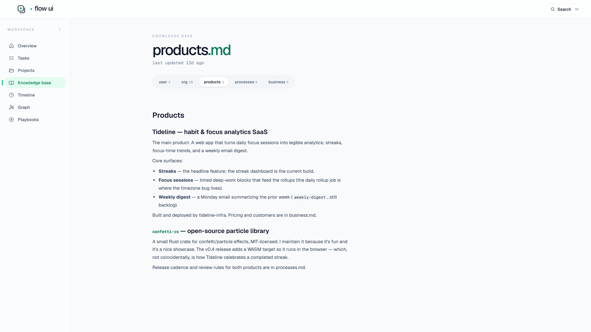
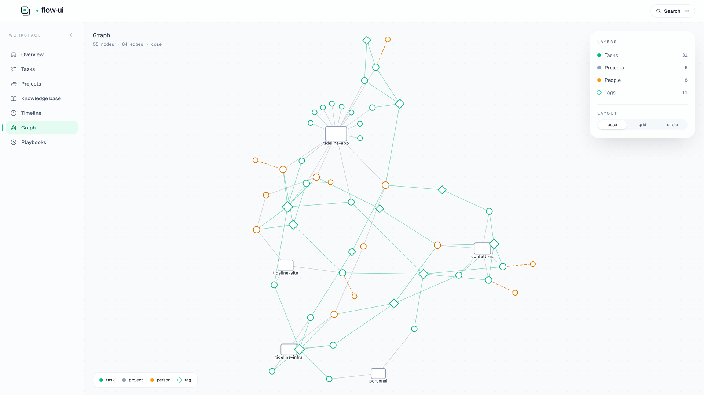

<p align="center">
  
</p>

<p align="center">
  <b>The dashboard for your <code>flow</code> workspace</b><br>
  <sub>Local · single binary · read-only · knowledge graph</sub>
</p>

<p align="center">
  <a href="LICENSE"></a>
  <a href="https://github.com/swapnildahiphale/flow-ui/releases"></a>
  
  
  <a href="https://github.com/swapnildahiphale/flow-ui/pulls"></a>
  <a href="https://github.com/swapnildahiphale/flow-ui/stargazers"></a>
</p>

<p align="center">
  <a href="https://d4ynwxqk9rcfdmgw.public.blob.vercel-storage.com/flow-ui-launch.mp4">
    
  </a>
  <br>
  <sub><a href="https://d4ynwxqk9rcfdmgw.public.blob.vercel-storage.com/flow-ui-launch.mp4">▶ Click to watch the 35-second walkthrough</a></sub>
</p>

<h4 align="center">
  <a href="#install">Install</a> ·
  <a href="#try-it-with-demo-data">Demo</a> ·
  <a href="#how-it-runs">How it runs</a> ·
  <a href="#faq">FAQ</a> ·
  <a href="#creator">Creator</a>
</h4>

---

**flow-ui** is a local, read-only web dashboard for [flow](https://github.com/Facets-cloud/flow) — the CLI task and project manager that keeps your work in a single SQLite database. It opens that database and shows your tasks, projects, knowledge base, progress updates, and tags, plus a force-directed **knowledge graph** of how they all connect. It's a single **Go** binary with the **React** UI embedded, runs entirely on `localhost`, needs no account, and sends nothing to the cloud. It's **read-only by design** — the `flow` CLI stays the only thing that ever writes to your data, so you can leave the dashboard open on a second monitor all day without worrying it'll touch anything.

## What it looks like

<table>
  <tr>
    <td width="50%"><br><sub><b>Overview</b> — what's in flight, pending, and waiting, at a glance.</sub></td>
    <td width="50%"><br><sub><b>Tasks</b> — filter by status, priority, tag, or project.</sub></td>
  </tr>
  <tr>
    <td width="50%"><br><sub><b>Knowledge base</b> — browse the notes your sessions left behind.</sub></td>
    <td width="50%"><br><sub><b>Knowledge graph</b> — the shape of your work, not a flat list.</sub></td>
  </tr>
</table>

## What it shows

| | |
|:--|:--|
| **Tasks & projects browser** | Filter by status, priority, tag, project; sort by recency, due date, or staleness. |
| **Knowledge-base viewer** | All five KB files (user / org / products / processes / business) with cross-references back to tasks and projects. |
| **Updates timeline** | A chronological feed of progress notes across all your tasks. |
| **Knowledge graph** | Nodes (tasks, projects, people, tags) and edges (assignment, waiting-on, project membership, tag co-occurrence). |
| **Insights** | Waiting-on leaderboard, tag co-occurrence, stale-task clustering, and an activity heatmap. |

## Install

In any Claude Code session, paste this:

> Install flow-ui from https://github.com/swapnildahiphale/flow-ui

Claude reads the repo, downloads the binary for your platform, drops it on your `$PATH`, and tells you how to launch it.

<details>
<summary>Manual install (curl + chmod)</summary>

```bash
# Pick your platform. ARM Macs use darwin-arm64; Intel Macs use darwin-amd64; Linux uses linux-amd64.
OS=darwin
ARCH=arm64

curl -fsSL -o /usr/local/bin/flow-ui \
  "https://github.com/swapnildahiphale/flow-ui/releases/latest/download/flow-ui-${OS}-${ARCH}"
chmod +x /usr/local/bin/flow-ui
xattr -d com.apple.quarantine /usr/local/bin/flow-ui 2>/dev/null || true

flow-ui
```

The `xattr` step is macOS-only — it removes Gatekeeper's quarantine attribute so the unsigned binary will run. Harmless on Linux.

</details>

flow-ui has no install step of its own — it reads `~/.flow/flow.db` directly. You need [flow](https://github.com/Facets-cloud/flow) installed and initialized (`flow init`) first.

### Upgrade

In any Claude Code session, paste this:

> Upgrade flow-ui from https://github.com/swapnildahiphale/flow-ui

Check the running version with `flow-ui --version`.

## Try it with demo data

No `flow` data of your own yet? A small, fully fictional sample dataset lives in
[`examples/demo-flow/`](examples/). Point flow-ui straight at it:

```bash
flow-ui --db examples/demo-flow/.flow/flow.db
```

See [`examples/README.md`](examples/README.md) for the persona behind the data
and a `seed.sh` that regenerates it from scratch.

## How it runs

A single Go binary boots a `localhost` HTTP server and opens your browser. The React frontend is embedded into the binary at build time, so installation is one download — no `node` required at runtime.

```bash
flow-ui              # boots on a free localhost port and opens browser
flow-ui --port 7777  # pin the port
flow-ui --no-open    # don't open the browser
flow-ui --version    # print version and exit
```

The binary reads `~/.flow/flow.db` directly in read-only mode. It never mutates anything; the `flow` CLI remains the only write path.

## FAQ

**Does flow-ui modify my data?**
No. It opens the database read-only and never writes. Every mutation still goes through the `flow` CLI.

**What's the difference between `flow` and `flow-ui`?**
[`flow`](https://github.com/Facets-cloud/flow) is the CLI that tracks your tasks, projects, and notes in a SQLite database. `flow-ui` is the read-only dashboard that visualizes that database in your browser.

**Is any of my data sent to the cloud?**
No. flow-ui runs entirely on `localhost`, needs no account, and makes no outbound calls. Your data never leaves your machine.

**Do I need Node.js installed?**
No. The React UI is embedded in the Go binary via `go:embed`. One download, no runtime dependencies.

**Which platforms are supported?**
macOS on Apple Silicon (`darwin-arm64`) and Intel (`darwin-amd64`), and Linux (`linux-amd64`).

**Do I need `flow` first?**
Yes — flow-ui reads `~/.flow/flow.db`, so install and `flow init` the CLI first. Or try the [demo dataset](#try-it-with-demo-data) with no setup.

## Stack

- **Backend:** Go (`net/http` + `modernc.org/sqlite`, pure-Go, no CGO)
- **Frontend:** Vite + React + TypeScript + Tailwind + shadcn/ui + TanStack Query + react-force-graph-2d (knowledge graph)
- **Distribution:** `//go:embed`-bundled SPA inside a single Go binary

## For contributors

Building from source requires Go, Node 20+, and pnpm 9+.

```bash
make build       # builds ./ui (vite) + ./flow-ui (go), one binary out
make dev         # runs vite dev server + go server with proxy
make test        # go test ./...
make smoke       # build + boot + curl the API
make install     # build + move binary into $GOBIN or $GOPATH/bin
```

Releases are cut by pushing a `vMAJOR.MINOR.PATCH` tag — the `release.yml` workflow builds all three target binaries with `CGO_ENABLED=0` and publishes them to GitHub Releases.

## Creator

<table>
  <tr>
    <td valign="middle">
      <strong>Swapnil Dahiphale</strong> · SRE · Builder<br>
      <em>Building tools that make my own week run smoother — then open-sourcing them.</em>
    </td>
    <td valign="middle" align="right" nowrap>
      <a href="https://swapnil.one"></a>
      <a href="https://www.linkedin.com/in/swapnil2233/"></a>
      <a href="https://github.com/swapnildahiphale"></a>
    </td>
  </tr>
</table>

## License

[MIT](LICENSE) — same as flow itself.
